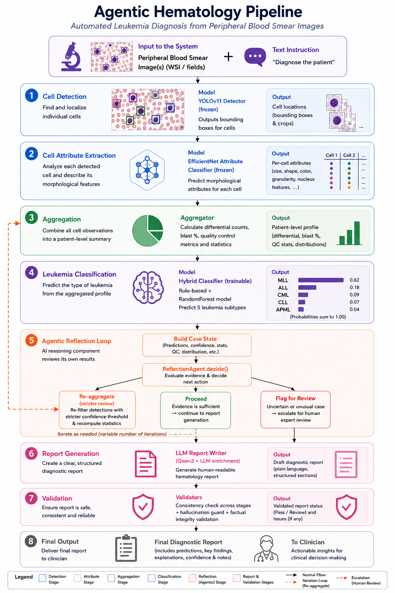
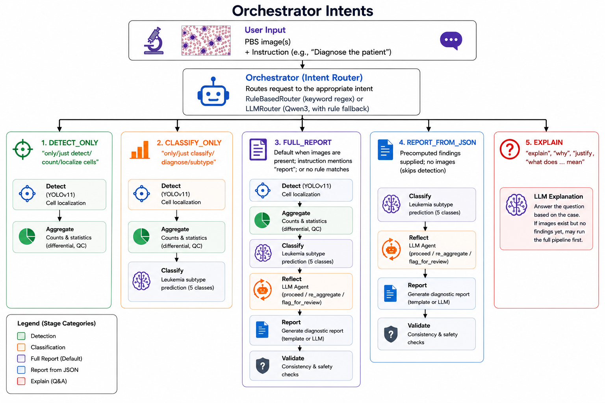

# Agentic Hematology Pipeline

End-to-end agentic orchestration for **LLD peripheral blood smear** analysis: two-stage computer vision (YOLO + attribute head), patient-level aggregation, learned leukemia classification, an LLM **reflection loop** that can adjust process control at runtime, and template or local-LLM report generation.

**Constraint:** do not edit code under `wbc_unified/` from this repo. Call its scripts read-only for dataset prep, training weights, and infer.

---

## Table of contents

1. [Architecture overview](#architecture-overview)
2. [Prerequisites and upstream training](#prerequisites-and-upstream-training)
3. [Entry point and run modes](#entry-point-and-run-modes)
4. [Intent routing](#intent-routing)
5. [Pipeline stages (validated from code)](#pipeline-stages-validated-from-code)
6. [Reflection agent (what makes it “agentic”)](#reflection-agent-what-makes-it-agentic)
7. [Report generation and validation](#report-generation-and-validation)
8. [Offline pipelines (no live detection)](#offline-pipelines-no-live-detection)
9. [Data contracts and outputs](#data-contracts-and-outputs)
10. [Configuration defaults](#configuration-defaults)
11. [SLURM and batch scripts](#slurm-and-batch-scripts)
12. [Module map](#module-map)

---

## Architecture overview

The orchestrator is a thin **router**: it parses the user instruction, selects an intent, and runs composable pipeline nodes in order. Clinical logic lives in specialized agents; the orchestrator only wires them together and threads a shared `PipelineState` (`schemas.py`).



*Full pipeline diagram: detection → attributes → aggregation → classification → reflection loop → report → validation.*

```
User request (images + instruction)
        │
        ▼
┌───────────────────┐
│  Intent router    │  RuleBasedRouter (default) or LLMRouter (Qwen3)
└─────────┬─────────┘
          │
          ▼
┌───────────────────┐     FULL_REPORT path:
│  detect_node      │ ──▶ YOLO localizer → crop → attribute head
└─────────┬─────────┘
          ▼
┌───────────────────┐
│  aggregate_node   │ ──▶ confidence filter, overlap dedup, differential
└─────────┬─────────┘
          ▼
┌───────────────────┐
│  classify_node    │ ──▶ HybridClassifier (learned model + rule fallback)
└─────────┬─────────┘
          ▼
┌───────────────────┐
│  reflect_node     │ ──▶ proceed | re_aggregate | flag_for_review
└─────────┬─────────┘     (optional; skipped with --no-agent)
          ▼
┌───────────────────┐
│  report_node      │ ──▶ template or local-LLM markdown
└─────────┬─────────┘
          ▼
┌───────────────────┐
│  validate_node    │ ──▶ consistency + LLM-output guards
└───────────────────┘
```

Implementation: `orchestrator.py` (`Orchestrator.handle`, `_run_full`) and `pipeline.py` (individual nodes).

---

## Prerequisites and upstream training

Before running the full agentic pipeline with `--backend wbc-unified`, you need:

| Artifact | Default path | Produced by |
|----------|--------------|-------------|
| YOLO detector weights | `wbc_unified/cv/runs/detector/train/weights/best.pt` | `wbc_unified/cv/train_detector.py` |
| EfficientNet attribute weights | `wbc_unified/cv/runs/attribute/train/best_attr.pt` | `wbc_unified/cv/train_attributes.py` |
| LLD train/test split + images | `wbc_unified/cv/generated/det_dataset/` | `wbc_unified/cv/data/prepare_dataset.py` |
| Patient stats JSON (rich classifier features) | `patient_WBC_stats_NoOveralp.json` | external preprocessing |
| Trained patient classifier | `runs/classifier/random_forest/leukemia_random_forest.pkl` | `train_leukemia_from_stats.py` |

### Dataset preparation (read-only)

Regenerate manifests and detection images when paths are stale:

```bash
python wbc_unified/cv/data/prepare_dataset.py \
  --data-root /nfs-stor/roba.majzoub/LeukemiaDataset_Organized \
  --out wbc_unified/cv/generated \
  --image-mode copy
```

Use `--image-mode copy` (not `hardlink`) when the dataset is on NFS and the output directory is on a different filesystem — hardlinks fail with `Invalid cross-device link`.

Attribute training reads image paths from `wbc_unified/cv/generated/attr_manifest.csv`. If that CSV still points at another user's NFS paths, training fails with `PermissionError`.

### Attribute training tips

Default batch size in `train_attributes.py` is **64**. Large batches (e.g. 256) plus DataLoader workers can trigger OOM kills (exit code **137**) on interactive GPU nodes. Start with:

```bash
python wbc_unified/cv/train_attributes.py \
  --config wbc_unified/cv/configs/dataset.yaml \
  --epochs 40 --batch 64 --device 0 --workers 0 \
  --project wbc_unified/cv/runs/attribute --name train
```

---

## Entry point and run modes

**CLI:** `run_orchestrator.py`

### Single patient

```bash
python run_orchestrator.py \
  --case-id 4 \
  --images "wbc_unified/cv/generated/det_dataset/images/test/4_*.png" \
  --yolo-weights wbc_unified/cv/runs/detector/train/weights/best.pt \
  --effnet-weights wbc_unified/cv/runs/attribute/train/best_attr.pt \
  --classifier-model runs/classifier/random_forest/leukemia_random_forest.pkl \
  --stats-json /home/roba.majzoub/AgenticHematology/data_preprocessing/patient_WBC_stats_NoOveralp.json \
  --instruction "Generate a full diagnostic report" \
  --device 0 \
  --out outputs/case_4
```

### Batch — LLD test split (13 patients)

Patient IDs and image grouping come from `wbc_unified/cv/generated/det_dataset/labels/{train,test}/` via `discover_lld_split_from_cv()` in `leukemia_features.py`. Images are read from `--lld-image-dir` (default: `wbc_unified/cv/generated/det_dataset/images`).

```bash
python run_orchestrator.py \
  --lld-split test \
  --classifier-model runs/classifier/random_forest/leukemia_random_forest.pkl \
  --stats-json /home/roba.majzoub/AgenticHematology/data_preprocessing/patient_WBC_stats_NoOveralp.json \
  --llm-model models/Qwen3-VL-4B-Instruct \
  --max-reflect-iterations 2 \
  --device 0 \
  --out outputs/batch_traced
```

### Batch — custom directory layout

`--patients-dir` expects subdirectories named by case ID, each containing an `images/` folder (`_discover_patients()` in `run_orchestrator.py`).

### Stub mode (no GPU)

Replays precomputed detections from JSON (`StubDetector` in `detection_agent.py`):

```bash
python run_orchestrator.py \
  --case-id 12 \
  --backend stub \
  --stub-source examples/sample_cases.json \
  --instruction "Generate a full diagnostic report"
```

### Detection backends

| `--backend` | Stage 1 | Stage 2 (attributes) |
|-------------|---------|----------------------|
| `wbc-unified` (default) | YOLOv11 | EfficientNet (`EfficientNetAttributeClassifier`) |
| `dinobloom` | YOLOv11 | DinoBloom MLP probes or k-NN (`DinoBloomAttributeClassifier`) |
| `stub` | JSON replay | n/a |
| `two-stage` | alias for `wbc-unified` | same |

Built by `build_detector()` in `run_orchestrator.py`; both production backends use `TwoStageDetectionAgent` (`detection_agent_v2.py`).

### Disable agentic components

`--no-agent` skips LLM intent routing and the reflection loop. The pipeline runs detect → aggregate → classify → report with `RuleBasedRouter` only (`run_orchestrator.py`, lines 524–526, 556–574).

---

## Intent routing

The router decides **which pipeline stages run**, not the diagnosis.



*Intent router (`RuleBasedRouter` / `LLMRouter`) and the pipeline stages executed for each intent.*

### Supported intents (`orchestrator.py`, `Intent` enum)

| Intent | Stages executed |
|--------|-----------------|
| `FULL_REPORT` | detect → aggregate → classify → reflect → report → validate |
| `DETECT_ONLY` | detect → aggregate |
| `CLASSIFY_ONLY` | detect → aggregate → classify |
| `REPORT_FROM_JSON` | classify → reflect → report → validate (findings injected from JSON) |
| `EXPLAIN` | optionally runs full pipeline first, then LLM answer |

### RuleBasedRouter (default without `--no-agent` still uses LLMRouter when agent mode is on)

Keyword regex patterns are checked in order (`orchestrator.py`, `_PATTERNS`):

- **CLASSIFY_ONLY** — e.g. “just classify”, “only diagnose subtype”
- **DETECT_ONLY** — e.g. “only detect cells”, “just count”
- **EXPLAIN** — “explain”, “why”, “justify”
- **FULL_REPORT** — instruction contains “report”
- **Default** — images present → `FULL_REPORT`; no images/instruction → `EXPLAIN`

Special cases:

- `forced_intent` on the request bypasses routing.
- Precomputed findings with no images → `REPORT_FROM_JSON`.

### LLMRouter (enabled when agent mode is on)

Uses the same Qwen3 client as the reflection agent (`LLMRouter` in `orchestrator.py`). On failure or unparseable output, falls back to `RuleBasedRouter`.

---

## Pipeline stages (validated from code)

Each stage mutates `PipelineState` (`schemas.py`). Errors append to `state.errors` but do not always abort the run.

### Stage 0 — Request assembly

`Orchestrator.handle()` creates `PipelineState` with `case_id`, `image_paths`, `text_input`, and `dataset_source` (default `"lld"`). If `precomputed_findings` is supplied, it is converted to `AggregatedFindings` via `_findings_from_dict()`.

---

### Stage 1 — Detection (`detect_node`, `pipeline.py`)

**Input:** `state.image_paths`  
**Output:** `state.detection_result` (`DetectionResult`)

**Agent:** `BaseDetectionAgent.detect(case_id, image_paths)` — implemented by:

#### StubDetector (`detection_agent.py`)

Loads a wbc_unified-style prediction JSON and filters cells by requested image paths. Used for development without GPU weights.

#### TwoStageDetectionAgent (`detection_agent_v2.py`)

Always runs in two stages:

1. **YOLOv11Localizer.localize()** — Ultralytics YOLO on each PBS tile **one image at a time** (memory safety). Produces per image: `bbox_xyxy`, `cell_type` (from 14-class LLD schema in `LLD_CLASSES`), `class_id`, `objectness`.
2. **Crop + attribute head** — Each box is cropped with `crop_padding` (default 4 px). The stage-2 head (`EfficientNetAttributeClassifier` or `DinoBloomAttributeClassifier`) runs on crops only, never full tiles.

Each output cell is a `Detection` (`schemas.py`):

- `cell_id`, `image_id`, `bbox_xyxy`
- `cell_type`, `objectness`, optional `cell_type_prob`
- `attributes` — six morphologic attributes (`ATTRIBUTE_ORDER` in `detection_agent_v2.py`): Nuclear_Chromatin, Nuclear_Shape, Nucleus, Cytoplasm, Cytoplasmic_Basophilia, Cytoplasmic_Vacuoles
- `attribute_probs` — sigmoid probabilities from EfficientNet

EfficientNet loads `wbc_unified/cv/runs/attribute/train/best_attr.pt` via `build_attribute_model()` from wbc_unified (read-only import).

**YOLO tuning flags** (`run_orchestrator.py`): `--conf-threshold`, `--iou-threshold`, `--det-imgsz`, `--det-batch`, `--no-half`, `--device`.

---

### Stage 2 — Aggregation (`aggregate_node`, `pipeline.py` → `aggregator.py`)

**Input:** `state.detection_result`, `state.conf_threshold` (default **0.25**)  
**Output:** `state.findings` (`AggregatedFindings`)

Steps in `aggregate()`:

1. **Confidence filter** — keep detections with `objectness >= conf_threshold`.
2. **Overlap deduplication** — LLD fields use 20% tile overlap. Detections are mapped to a global canvas using filename grid coordinates (`_parse_filename_grid`), then class-agnostic NMS with IoU threshold **0.2** (`IOU_MATCH_THRESHOLD`).
3. **Informative WBC filter** — exclude `None` and `Unknown` (`EXCLUDED_CLASSES`).
4. **Differential** — counts and percentages over 13 informative cell types; clinical percentages exclude artifacts.
5. **Blast burden** — sum of Myeloblast, Lymphoblast, Monoblast, Abnormal promyelocyte; `blast_threshold_met` when ≥ 20%.
6. **Morphology cohort** — per cell type, positive rates for each attribute.
7. **Grounding index** — per-cell record for report citations.
8. **QC block** in `report_ready` — mean detection confidence, fraction classified as None, overlap-correction metadata.

The reflection agent can trigger **re-aggregation** at a stricter `conf_threshold` (see below).

---

### Stage 3 — Classification (`classify_node`, `pipeline.py` → `leukemia_classifier.py`)

**Input:** `state.findings`  
**Output:** `state.classification` (`LeukemiaClassification`)

**HybridClassifier** logic:

1. **Learned model path** (if `--classifier-model` exists): loads pickled RF / XGBoost / LightGBM via `LearnedClassifier`. Feature keys come from `{model_stem}_meta.json`.
2. **Rich features from stats JSON** — when the model expects keys like `attr_*`, `group_*`, or `blast_pool_percentage_of_wbc`, features are built from `patient_WBC_stats_NoOveralp.json` for the matching `case_id` (`build_feature_row_from_stats()` in `leukemia_features.py`), not from live detection aggregates.
3. **Rule fallback** — if no learned model or prediction fails, heuristic rules on differential percentages and blast burden (ALL, AML, APML, CML, CLL, etc.).

Classes: `ALL`, `AML`, `APML`, `CLL`, `CML` (`DEFAULT_CLASSES` in `leukemia_classifier.py`).

The reflection agent **does not change** this diagnosis; it only influences whether to re-run aggregation + classification with different detection filtering.

---

### Stage 4 — Reflection (`reflect_node`, `pipeline.py` → `agent_controller.py`)

**Skipped when:** `--no-agent`, or `reflection_agent is None`, or `state.findings is None`.

**Purpose:** LLM-driven **process control** after deterministic classification.

The agent receives a compact `case_state` from `build_case_state()`:

- Clinical differential percentages, blast %, flags
- QC: mean detection confidence, % None class
- Classifier output (predicted class, confidence, rationale)

**Actions** (`AgentAction` enum):

| Action | Effect |
|--------|--------|
| `proceed` | Exit loop; continue to report |
| `re_aggregate` | Set stricter `conf_threshold`, re-run `aggregate_node` + `classify_node`, reflect again (**once max**) |
| `flag_for_review` | Set `state.flagged_for_review`, append reason, exit loop |

**Safety rules** (`ReflectionAgent.decide()`):

- Parse failures → `flag_for_review`
- `re_aggregate` disallowed if already used once → escalates to `flag_for_review`
- Threshold clamped to [0.1, 0.9]; must be stricter than current threshold
- Loop runs at most `--max-reflect-iterations` (default **2**); exhaustion → forced review flag

Decisions are appended to `state.agent_actions` for audit (`case_<id>_agent_trace.json`).

---

### Stage 5 — Report (`report_node`, `pipeline.py` → `report_generator.py`)

**Input:** `state.findings`, `state.classification`, `state.text_input`  
**Output:** `state.report` (`GroundedReport`)

Backends (`--report-backend`):

| Backend | Implementation |
|---------|----------------|
| `template` (default) | `TemplateReportGenerator` → `wbc_unified/report/src/template_report.py` |
| `local-llm` | `LocalLLMReportGenerator` → Qwen3 + optional LoRA |
| `claude`, `openai` | Placeholders; currently inherit template behavior |

All backends receive a JSON summary via `_summary_with_agent_context()` including classification scores and grounding index. Template reports also append:

- **Quantitative Cell Summary** table (`_append_quantitative_summary`)
- **Agentic Diagnosis** and **Cell Grounding** sections (`_append_grounding`)

If `state.flagged_for_review`, a markdown banner is appended in `report_node()` before validation.

When agent mode and `local-llm` are both enabled, one Qwen3 instance is shared between router, reflection, explain, and report generation (`QwenLLMClient.attach()`).

---

### Stage 6 — Validation (`validate_node`, `pipeline.py` → `validators.py`)

**Input:** completed `state.report`, `state.classification`  
**Output:** `state.consistency_passed`, `state.llm_output_passed`

Checks:

1. **ReportConsistencyValidator** — predicted class string must appear in report markdown (if classification exists).
2. **LLMOutputValidator** — report must be non-empty and must not contain generic refusal phrases (`"as an ai language model"`, `"i cannot diagnose"`).

Note: `validate_failure_policy` is accepted by `validate_node()` but **not currently applied** — failed validation sets flags only; the report is not stripped or regenerated.

---

## Reflection agent (what makes it “agentic”)

Compared to a fixed pipeline, the agentic path adds:

1. **LLM intent routing** — interprets free-text instructions when keywords are ambiguous.
2. **Reflection loop** — a model inspects intermediate QC + classification coherence and chooses runtime control flow.
3. **Audit trail** — every decision recorded in `agent_actions` and written to `case_<id>_agent_trace.json`.

What stays **deterministic**:

- YOLO localization and attribute inference
- Aggregation math (except threshold, which the agent may raise once)
- Final diagnosis from `HybridClassifier` / `LearnedClassifier`

Summarize batch traces:

```bash
python analyze_agent_trace.py --agentic-dir outputs/batch_traced
```

This reports action sequences (`proceed`, `re_aggregate`, `flag_for_review`) and optional accuracy vs ground truth from the stats JSON.

---

## Offline pipelines (no live detection)

These run outside the orchestrator but feed into it.

### Patient classifier training (`train_leukemia_from_stats.py`)

- **Features:** 42-dimensional matrix from `patient_WBC_stats_NoOveralp.json` (`leukemia_features.py`) — cell-type percentages, blast pool, attribute states, lineage groups, QC.
- **Split:** 34 train / 13 test patients from wbc_unified label filenames (same as CV split).
- **Backends:** `random_forest`, `xgboost`, `lightgbm` via `tabular_classifier.py`.
- **Evaluation:** stratified CV on train only; final model fit on train; hold-out metrics on 13 test patients.
- **Outputs:** `runs/classifier/{backend}/leukemia_{backend}.pkl`, `_meta.json`, `_predictions.json`, SHAP plots.

```bash
python train_leukemia_from_stats.py --backend random_forest \
  --stats-json /home/roba.majzoub/AgenticHematology/data_preprocessing/patient_WBC_stats_NoOveralp.json \
  --out-dir runs/classifier/random_forest
```

### Template report batch (`run_lld_report_pipeline.py`)

CPU-only reports from stats JSON + classifier predictions (no YOLO/EfficientNet at runtime unless `--run-detection`):

```bash
python run_lld_report_pipeline.py --backend random_forest --split test
```

Writes under `runs/reports/{backend}/test/reports/case_<id>_report.md`.

---

## Data contracts and outputs

### Core datatypes (`schemas.py`)

| Type | Role |
|------|------|
| `Detection` | Single cell with bbox, type, attributes |
| `DetectionResult` | All cells for one case |
| `AggregatedFindings` | Patient differential, morphology, `report_ready` dict |
| `LeukemiaClassification` | Predicted class, confidence, rationale, scores |
| `GroundedReport` | Markdown + grounding index + backend name |
| `PipelineState` | Full mutable state including agent trace fields |

### Per-case output files (`_save_outputs()` in `run_orchestrator.py`)

Written to `--out` (batch mode: `--out/<case_id>/`):

| File | Contents |
|------|----------|
| `case_<id>_detections.json` | All cells: bbox, class, confidence, binarized attributes |
| `case_<id>_classification.json` | Predicted leukemia class + confidence + rationale |
| `case_<id>_report.md` | Final markdown report |
| `case_<id>_agent_trace.json` | Reflection iterations, actions, review flags |
| `case_<id>_explain.txt` | EXPLAIN intent answer (if applicable) |

`OrchestratorResponse.to_dict()` also exposes `consistency_passed`, `llm_output_passed`, and `errors`.

---

## Configuration defaults

From `run_orchestrator.py`:

| Setting | Default |
|---------|---------|
| YOLO weights | `wbc_unified/cv/runs/detector/train/weights/best.pt` |
| EfficientNet weights | `wbc_unified/cv/runs/attribute/train/best_attr.pt` |
| Classifier | `runs/classifier/random_forest/leukemia_random_forest.pkl` |
| Stats JSON | `/home/roba.majzoub/AgenticHematology/data_preprocessing/patient_WBC_stats_NoOveralp.json` |
| LLD images | `wbc_unified/cv/generated/det_dataset/images` |
| Detection conf / IoU | 0.25 / 0.5 |
| YOLO image size | 640 |
| YOLO batch | 1 (one tile at a time) |
| Aggregation conf (initial) | 0.25 (`PipelineState.conf_threshold`) |
| Max reflect iterations | 2 |
| Report backend | `template` |

Environment activation (see `scripts/instructions.sh`):

```bash
source /apps/local/anaconda3.10/bin/activate /home/roba.majzoub/envs/agentic/
cd /home/roba.majzoub/agentic_hematology
```

---

## SLURM and batch scripts

| Script | Purpose |
|--------|---------|
| `scripts/sbatch_orchestrator.sh` | Single patient, GPU, agentic options |
| `scripts/run_batch_agentic_traced.sh` | Full test-split batch with traces |
| `scripts/sbatch_train_yolo.sh` | YOLO training via wbc_unified |
| `scripts/instructions.sh` | End-to-end command reference |

---

## Module map

| Module | Role |
|--------|------|
| `run_orchestrator.py` | CLI, detector/classifier wiring, batch discovery, output I/O |
| `orchestrator.py` | Intent routing, intent handlers, `OrchestratorResponse` |
| `pipeline.py` | Composable nodes: detect, aggregate, classify, reflect, report, validate |
| `agent_controller.py` | `QwenLLMClient`, `ReflectionAgent`, `build_case_state` |
| `detection_agent.py` | `BaseDetectionAgent`, `StubDetector`, `LLD_CLASSES` |
| `detection_agent_v2.py` | `YOLOv11Localizer`, `EfficientNetAttributeClassifier`, `TwoStageDetectionAgent` |
| `detection_agent_dinobloom.py` | DinoBloom attribute head (probes / k-NN ablation) |
| `aggregator.py` | Patient aggregation, overlap dedup, blast/QC flags |
| `leukemia_classifier.py` | `HybridClassifier`, `LearnedClassifier` |
| `leukemia_features.py` | Feature matrix + LLD split discovery |
| `train_leukemia_from_stats.py` | Offline classifier training + SHAP |
| `run_lld_report_pipeline.py` | Offline template reports from stats + predictions |
| `report_generator.py` | Template / local-LLM report backends |
| `tabular_classifier.py` | sklearn/LGBM/XGB builders |
| `schemas.py` | Shared dataclasses |
| `validators.py` | Report consistency and LLM-output guards |
| `analyze_agent_trace.py` | Batch reflection trace summarizer |

---

## Quick start (minimal)

```bash
source /apps/local/anaconda3.10/bin/activate /home/roba.majzoub/envs/agentic/
cd /home/roba.majzoub/agentic_hematology

# 1) Train classifier (CPU)
python train_leukemia_from_stats.py --backend random_forest \
  --out-dir runs/classifier/random_forest

# 2) Full agentic batch on 13 test patients (GPU + weights + Qwen for agent mode)
python run_orchestrator.py \
  --lld-split test \
  --classifier-model runs/classifier/random_forest/leukemia_random_forest.pkl \
  --stats-json /home/roba.majzoub/AgenticHematology/data_preprocessing/patient_WBC_stats_NoOveralp.json \
  --llm-model models/Qwen3-VL-4B-Instruct \
  --device 0 \
  --out outputs/batch_traced

# 3) Summarize agent decisions
python analyze_agent_trace.py --agentic-dir outputs/batch_traced
```

For the full command sequence including dataset prep and attribute training, see `scripts/instructions.sh`.

### Troubleshooting — LLM intent router / reflection agent

On GPU nodes, Qwen generation can fail with `libpython3.10.so.1.0: cannot open shared object file`. Export conda libs before running agentic mode:

```bash
export LD_LIBRARY_PATH="${CONDA_PREFIX}/lib:${LD_LIBRARY_PATH:-}"
```